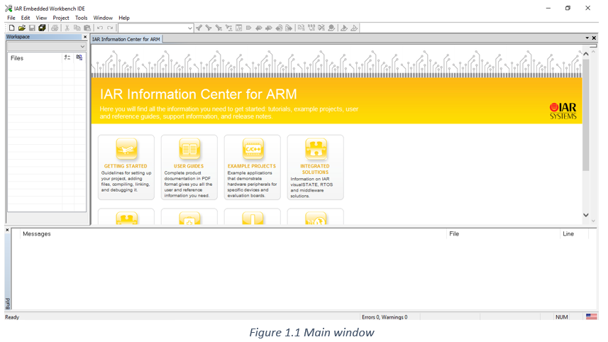
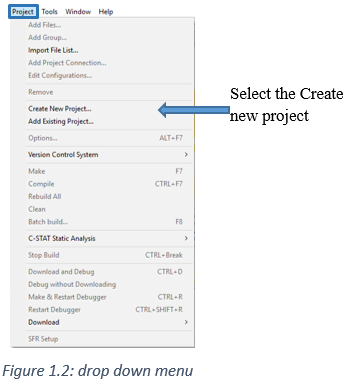
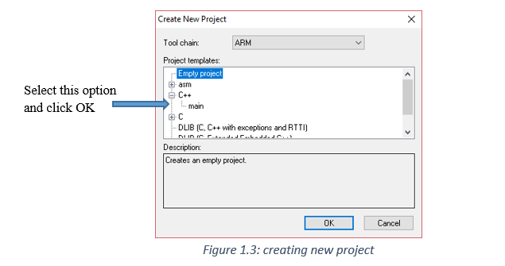
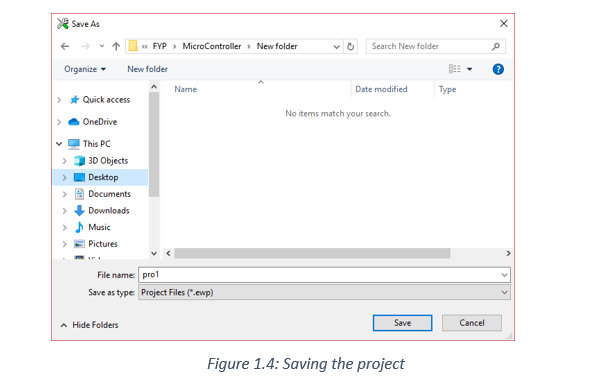
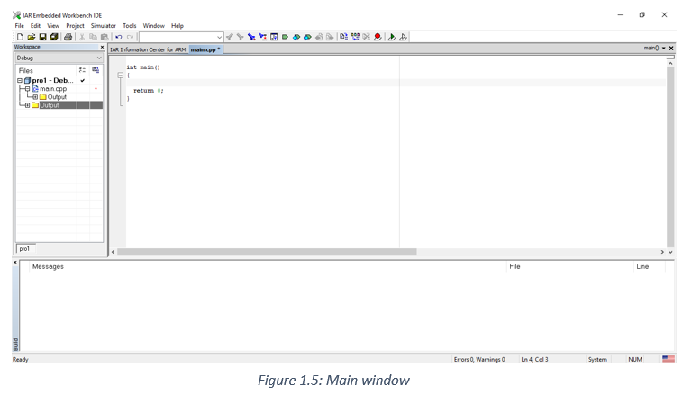
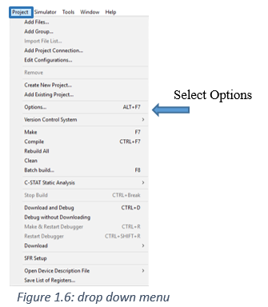
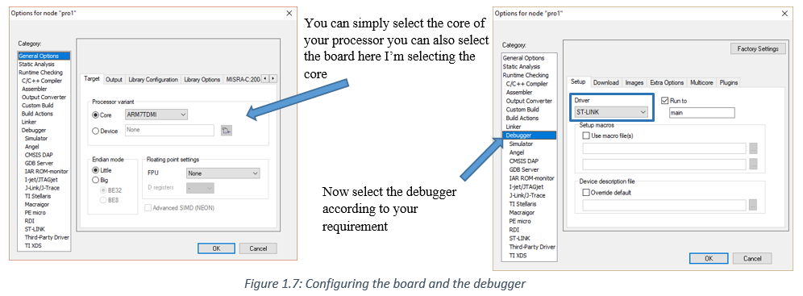
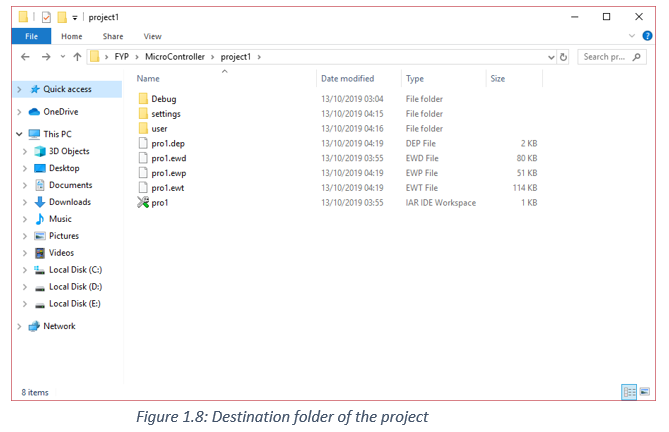

# stm32f4xx_startup_files
## Starting new project on IAR Workbench
Launch the IAR application and following window will pop up as shown in the figure 1.1

Initially the workspace is completely empty 

At the top there is option termed as the project click and the following drop down value appears as shown in the figure 1.2

After selecting new project following window will pop up on the screen as shown in figure 1.3

Now save the project as shown in figure 1.4

Now we got something to start our project as shown in the figure 1.5

At the top there is option termed as the project click and the following drop down value appears as shown in the figure 1.6

Selecting the options, the following window will pop up as shown in figure 1.7
 

Open the folder where you save your project, we got the following files as shown in the figure 1.8

After creating the new project, we got the following files and folder as shown in the figure 1.8

.DEP file  contains run-time requirements for a program

.EWD file  is the debugger setting file

.EWP file  is the project file of IAR workbench

.EWT file   if you use C-STAT or C-RUN

There is an additional folder termed as the user created by user and I place my main.cpp file in project file.
